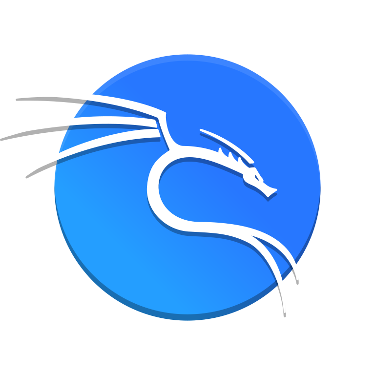
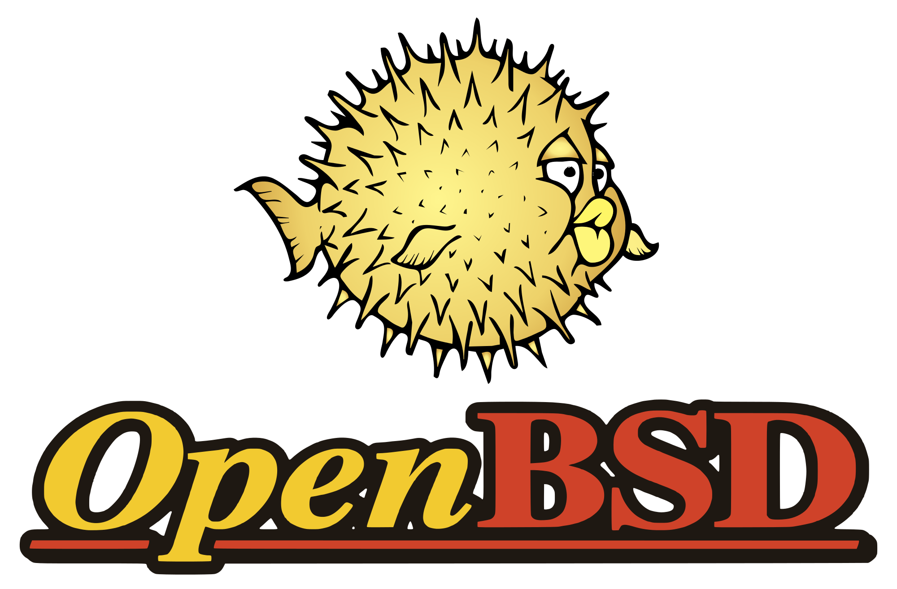

# Hi there 👋

  <!-- Typing SVG by DenverCoder1 - https://github.com/DenverCoder1/readme-typing-svg -->
    
     
    

  🎮 You can start a <a href='https://www.chess.com/member/rubi960'>♟Chess game</a> with me, my actual

  

Random dev joke!

  📣 Formas de contactarme 
  
  
  
  
  
  

  
<b>Lenguajes y herramientas</b>

   
  

    
    
    
    
    
    
    
    
    
    
    
    
    
    
    
    
    
    
    
    
    
    

  

  
<b>SOs que he usado</b>

   
  

    
    
    
    
    
    
    
    
    
    
    
  

  
<b>Idiomas [icono de algo]</b>

   
  

    
    
    
  

  
<b>Stats</b>

     
    

<!--START_SECTION:waka-->

<!--END_SECTION:waka-->

    Hay algo llamado waka y que está en esta [web](https://github.com/anmol098/waka-readme-stats) y sirve para hacer stats chulas
    

    

     

   

   
   

   
    
   

   
 
   

<!--
**Rubi960/Rubi960** is a ✨ _special_ ✨ repository because its `README.md` (this file) appears on your GitHub profile.

Here are some ideas to get you started:

- 🔭 I’m currently working on ...
- 🌱 I’m currently learning ...
- 👯 I’m looking to collaborate on ...
- 🤔 I’m looking for help with ...
- 💬 Ask me about ...
- 📫 How to reach me: ...
- 😄 Pronouns: ...
- ⚡ Fun fact: ...
-->
