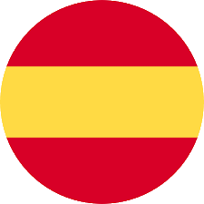
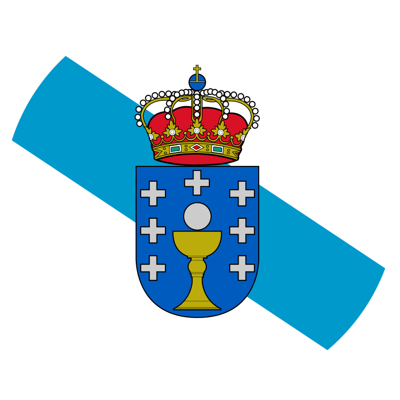

<h1 align="center"> Hi! :wave: I am <a href="https://www.linkedin.com/in/rubendizmartinez">Rubén Diz</a>. </h1> 

<!-- Typing SVG by DenverCoder1 - https://github.com/DenverCoder1/readme-typing-svg -->

## :incoming_envelope: Contact me

  
  
  
  
  

## :student: About Me

- :desktop_computer: Master Student at [University of A Coruña](https://www.udc.es/).
- :mortar_board: Graduated in [Computer Science](https://estudos.udc.es/en/study/detail/614G01V01) (2020-2024) and currently studying the first year of the [Master in Cybersecurity (MUniCS)](https://www.munics.es/).
- :video_game: In my free time I like to watch movies, play video games and learn languages.   
- :dart: Currently interested in cybersecurity and programming in general.
- :books: Always learning.

## :computer: Tech Stack

 
 
 
 
 
 

 
 
 
 
 
 
 
 
 
 
 
 
 
 
 

## :cd: Operating Systems

![NetBSD](https://img.shields.io/badge/NetBSD-%23F15A2C.svg?style=for-the-badge&logoColor=black&logo=data:image/png;base64,iVBORw0KGgoAAAANSUhEUgAAABoAAAAUCAMAAACknt2MAAABfGlDQ1BpY2MAACiRfZE9SMNQFIVPU6VFKg52KOKQoTpZEBVx1CoUoUKoFVp1MHnpHzRpSFJcHAXXgoM/i1UHF2ddHVwFQfAHxMnRSdFFSrwvKbSI8cHlfZz3zuG++wChWWWa1TMOaLptZlJJMZdfFUOvCEOgiiEsM8uYk6Q0fNfXPQJ8v0vwLP97f65+tWAxICASzzLDtIk3iKc3bYPzPnGUlWWV+Jx4zKQGiR+5rnj8xrnkssAzo2Y2M08cJRZLXax0MSubGvEUcVzVdMoXch6rnLc4a9U6a/fJXxgp6CvLXKcaRgqLWIIEEQrqqKAKGwnadVIsZOg86eMfcv0SuRRyVcDIsYAaNMiuH/wPfs/WKk5OeEmRJND74jgfI0BoF2g1HOf72HFaJ0DwGbjSO/5aE5j5JL3R0eJHwMA2cHHd0ZQ94HIHiD0Zsim7UpBKKBaB9zP6pjwweAv0rXlza5/j9AHI0qzSN8DBITBaoux1n3eHu+f27532/H4A5xZyb1PSuFcAAAAgY0hSTQAAeiYAAICEAAD6AAAAgOgAAHUwAADqYAAAOpgAABdwnLpRPAAAAdpQTFRFAAAA1DkABwIA0zgA1ToA0zcArBoA1z4A1DgAzzIAZBsA1DkA1DkA1DkA1DkA1DkA1DkA1DkA1DkA1DkA1DkA1DkA1DkA1DkA1DkA1DkA1DkA1DkA1DkA1DkA1DkA1DkA1DkA1DkA1DkA1DkA1DkA1DkA1DkA1DkA1DkA1DkA1DkA1DkA1DkA1DkA1DkA1DkA1DgA0zgA1DgA1DgA1DgA1DkA0zcA1DgA1DkA1DkA1DkA1DkA1DkA1DgA0zgA0jYA0jYA0zgA1DgA1DkA1DkA1DkA1ToA0zgA0zcA0jYA0zgA0zgA0zgA0zcAzjAA0jYA0zgA0zgA0zgA1DgA1DkA1DgA1DgA1DkA1DkA0zgA0zcA0DMA0zgA1DkA1DkA1DkA1DkA1DkA1DkA1DkA1DkA0zgA0zgA0TUA1DgA1DkA1DkA1DkA1DkA1DkA0zgA0zgA0zcA0zcA0zgA1DkA1DkA1DkA0zgA1DkA1DkA1DkA1DkA1DkA1DkA1DkA1DkA0zgA1DkA1DkA1DkA1DkA1DkA1DkA0zgA1DkA1DkA1DkA0zgA1DkA1DkA1DkA1DkA0zgA1DkA1DkA1DgA1DgA1DkA0zgA0zgA1DkA1DkA1DkA1DkA1DkA1DkA////qDrLbgAAAJx0Uk5TAAAAAAAAAAAAAAAKGBsRAgU7h7vT18miXRclnfD9zFYDN8/2fQcn0Pnr4dmm5bZ7STlPdocoHoC30di5kFsnCBRPjrXtnAI+NwUTGBIHBiIpMlR9p7wkEpZkEwIxiNL0/vhTINyGRwM2mel06sNnMAsMHnwc3XbHxW2+s0iA8mXV1hou5qOAg3/sWh+qmEZTS2ZZeOQIHI26pXMwIgr8xgAAAAFiS0dEnQa78rEAAAAJcEhZcwAACxIAAAsSAdLdfvwAAAAHdElNRQfpAgQADDCCUVt9AAABv3pUWHRSYXcgcHJvZmlsZSB0eXBlIGljYwAAOI2lU1uOHCEM/OcUOYLxszlODzRS7n+BGAzz2tlIm1hq0ZSxXTZF+l1r+jVMDRMMwxO0KmkzAqYJadPL2FCQjRFBDilyIoBd7O5jRMWax/+RNCsZGXAWEOAK/2Ddqw5GeQONsN2Z/dDSD883ZRUjjUIZF8yQvDEwNA6HLgepmU8INl6OwDM738PHsfBzjQJr8nHOMYajPQJe8KvecXvCNyHHRyL2mwmqmHlVAA/4jH9zPg2qhtpiT9vBPgsXwGrB2b3gvHHbrXFyuJro+y3tm6wqeokI7YDl9gQ+QuDin5OQcWujUR1KE1/doX5oDBnb2l9xZkhCcCXAdwLp7wzy+WAgsIphFJtFKIoweyLt40H4lx8M4PEknmwoGN4E7JpSIsJnQWaoHJHSrj6MUObeymTYW4GJ384817YqUaszUXUWnxhoj87o6JGQykemyKUHo37M27hp5Y8Jsdj02zHXfDQHNLts7m2ORHvyqG4zL54WQ5AyAylkBqfcXnQXRjsRnNRmoHAIjGudB0sp56oQibvU73S3h/127bDf3Bfh/UeiVyGmP/gKH/xAhELjAAABO0lEQVQoz2NgAAFGEODm4eXjBzEYkACQKyAoJCwiKiYuIQnkMCHLSEnLzAEDWTl5BYQ+oIyi0hw4UFZRZWSGS6mpwyU0NLW0JVhYIfrYGFV1oIbp6ukbGBoZm5hCjWRkNjO3sLRSt7axtbN3cHRyVndxVYBKubl7eHp5+/iyM7L6+QcEBgWHhIZxQKTCIyKjmJmZWTlZOaJjYuPiExISkyAmMianpKYxsrIyM6ZnZGZBbM2GSknl5OblFxQWGYlrwtxZDJUqKU0ssy6vKNVA+K0SKsVdNafaZA4ySKyBSjHWzqmrb0CWamyCOp6xuWVOaxuyVDvMy4yMHXM6u5C0qXfDApiRka9nTm8wXKalDx5nXIyMPOJa/Y1QGasJjCixwj1x0mRwCE+JMEWJZ1CsT5023XnGzFmzFeAyAOfKhF0xMwKtAAAAJXRFWHRkYXRlOmNyZWF0ZQAyMDI1LTAyLTA0VDAwOjEyOjM3KzAwOjAwacPt1AAAACV0RVh0ZGF0ZTptb2RpZnkAMjAyNS0wMi0wNFQwMDoxMjozNyswMDowMBieVWgAAAAodEVYdGRhdGU6dGltZXN0YW1wADIwMjUtMDItMDRUMDA6MTI6NDgrMDA6MDCzBg1HAAAAG3RFWHRpY2M6Y29weXJpZ2h0AFB1YmxpYyBEb21haW62kTFbAAAAInRFWHRpY2M6ZGVzY3JpcHRpb24AR0lNUCBidWlsdC1pbiBzUkdCTGdBEwAAABV0RVh0aWNjOm1hbnVmYWN0dXJlcgBHSU1QTJ6QygAAAA50RVh0aWNjOm1vZGVsAHNSR0JbYElDAAAAAElFTkSuQmCC)

![Solaris](https://img.shields.io/badge/Solaris-FCC624?style=for-the-badge&logo=data:image/png;base64,iVBORw0KGgoAAAANSUhEUgAAACYAAAAYCAYAAACWTY9zAAAAIGNIUk0AAHomAACAhAAA+gAAAIDoAAB1MAAA6mAAADqYAAAXcJy6UTwAAAAGYktHRAD/AP8A/6C9p5MAAAAHdElNRQfpAgQACxGBed3kAAAEe0lEQVRIx+3WW4ydVRUH8N/+zplzZuy00AuNLTchXAW8hBJMFEwIRqPhEoK+UCCBcAmEQhyMEirMA5cEnSiKhqRvEtDAgwYJwQhBLUUIEC7lTmgqlAJtZ6Aztsy053ybh71OORlQqNTEB1dycr58395r/9d/rfVfm/9RS/8tx+Mj++x6znFUiqeeLRzb/C/3N/cUkImRRXIcniW5xFwlee5kNW/rnLzdUJ62UzMlOX8cI3uMsQDWSvIAtmVJJct8G5vweCxdHCRunkrDapVKRnbgT9fvecbCKnwP65P8YCTuGOzdB+xL2Ae3z8tTuxiebf8xsF4N9ddNkqcxhZUBZBjnYHUsOR7X4VbIklq1F3kmMT07wk/L0OE4OUtz490wvobvxrfP4SAcGoAOxN96a5N8ZmLBHmMsIs5J3owVST4LV2AC7+IreFhJbSeCeAz7o4vLAvx63AFbRhb3dfBu2paRxSr17NffwN14CDcqxf4q3psVSCPJS3EsfotXcCZehq5GAzXybjO2I7W084wkt9HA9mBiNf6JF7ExKy3fk45KLcldvB6s3oR1eAOL0GroHpylR9DZbWCDeVqW5uBbkYpn8QCujcjHCzuVhWObPrR/YmQRRU6uS/KJ+DPm423clOROkne/+KMLp3FP/K7CvRH1OLyXhiz6CFCwYGxLz89ObFZq7gWszNJ9kXLp3NFbdTU+MbCnmsc4ecdffLmz1ikzf2pgBY5v6F76+/Z3xu9vfV1x/u/V+4DuBj/afvNAR/P0Sn3/883D37mrfZoNjSXaeYe0fHQVzAk6pzBZqXNdyBxQxDBHdJ0QxHlw25sXTG4aXpIW15va5+31y3qngQVK3Y37QJcG0KrU22rVAqUhOhjsqrY9OfCFeiDvrL7Yea43Ed5BSstHV30T31fU+U38GGtxBK6J/yYexbWV+q1a9Sul5S8fzDPd7WlwWSX/EEsVHfsHrg4/J+HiqKWLwmetSMtFWdqa5FGcEMTci9VN3IwtsQk24DMYi0NWKAL5c0yQrsbBEXWaTm2VPKW0/zrsqwjppQFoPk7FYbirD+yxaCX5VJwf6x8L0OuaGIpUDuCJ+HCcIpCX4aEkr8nSGTipLmnsxrrePHopfr1yWBfs9cqtxk9w+64eKj4yBtGKjG3EVooaXxkb74mNhyo3gJbSwrKUY9NctPsA9Wxf/Ax34hYcHQf3bEYR09nWwB+C7ZV4EGej2Qx6/4rTcEOA/F1ENafPyVCwMaOnnfRuB1fhq7ggSuE3cWi/fZQ0JWVKXIhlAW4Mr1ZB4URE+1Kk4DVMKqNmEIdEatckeTIcttDK0lAwtFER2xYW9rH6cWOvjWYuc/XuIGN+E7/AvAC4FNck+Zks/RqXKPepuXHwLbWqk+QNOAO34Xrchx/gj9gRYHpy0Q2W+wds710ngr84le+fj9T+PS0fXXUEjgrkaxPP5bKoFfQeFow+rHQv5epyXDhfo2jTCfgsno6UD+OZqNcj8ZQobCyJLDyhSNEy7KfI1aOY7Ans/+2T2vv6tIZO8hbX1AAAACV0RVh0ZGF0ZTpjcmVhdGUAMjAyNS0wMi0wNFQwMDoxMTowMSswMDowMG+rZA4AAAAldEVYdGRhdGU6bW9kaWZ5ADIwMjUtMDItMDRUMDA6MTE6MDErMDA6MDAe9tyyAAAAKHRFWHRkYXRlOnRpbWVzdGFtcAAyMDI1LTAyLTA0VDAwOjExOjE3KzAwOjAw5pnIyQAAAABJRU5ErkJggg==)

## Languages

  <code></code>
  <code></code>
  <code></code>

## 📊 GitHub Stats

<!--
**Rubi960/Rubi960** is a ✨ _special_ ✨ repository because its `README.md` (this file) appears on your GitHub profile.

Here are some ideas to get you started:

- 🔭 I’m currently working on ...
- 🌱 I’m currently learning ...
- 👯 I’m looking to collaborate on ...
- 🤔 I’m looking for help with ...
- 💬 Ask me about ...
- 📫 How to reach me: ...
- 😄 Pronouns: ...
- ⚡ Fun fact: ...
-->

